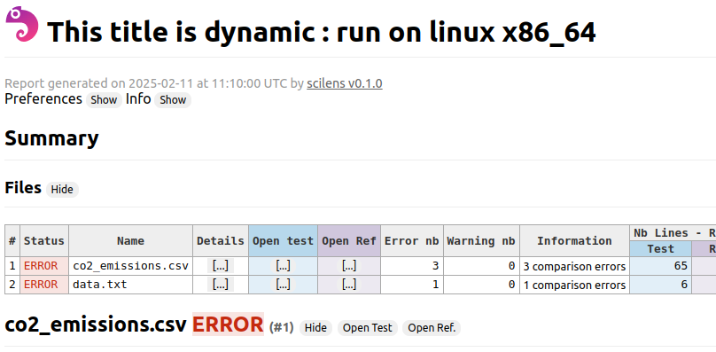

# Manage Variables and Dynamic Configuration

## Instructions

1. `cd` to this folder
2. Run `scilens --log-level=DEBUG run .`

## Explainations

This demo shows how to manage dynamic configuration based on variables.

scilens will compare :

- the 2 files `co2_emissions.csv`, and find 3 comparison errors
- the 2 files `data.txt`, and find 1 comparison errors
- generate an html report

In the log, you can see the template strings applied:

```log
2024-12-16 08:29:10 93cc657e72cb root[262] DEBUG with config {
    "processor": "Compare",
    "variables": {
        "parameter_1": "parameter_1_value",
        "parameter_2": "parameter_2_value parameter_1_value",
        "env_home": "/root",
        "python_version": "3.11.2",
        "os_arch": "linux_x86_64"
    },

```
from the configuration file
```yaml
variables:
  parameter_1: parameter_1_value
  parameter_2: "parameter_2_value {{ vars.parameter_1}}"
  env_home: "{{ env.HOME }}"
  python_version: "{{ sys.python }}"
  os_arch: "{{ sys.os }}_{{ sys.arch }}"
```


and the title of the report 



from the configuration file
```yaml

report:
  title: "This title is dynamic : run on {{ sys.os }} {{ sys.arch }}"
  output:
    export_html: true

```