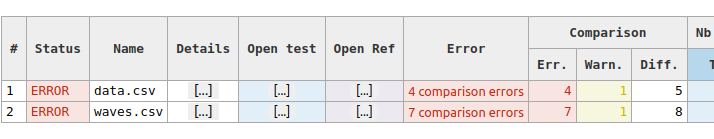
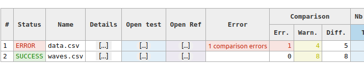
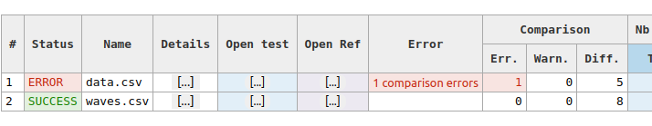
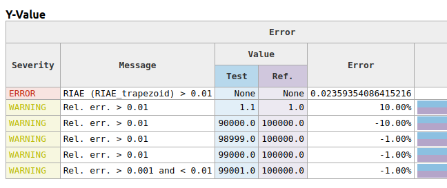
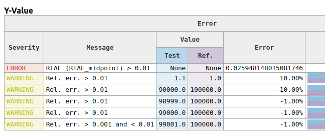

# Compare Vectors with ponderation

## Preriquisites

**For tests D, E and F**, package `scilens-compare` should be installed with `pip install scilens-compare`.

## Instructions

1. `cd` to this folder
2. **TEST A** `scilens run --config scilens-without-ponderation.yml .`
3. **TEST B** `scilens run --config scilens-with-amplitude-moderation.yml .`
4. **TEST C** `scilens run --config scilens-with-amplitude-moderation-ignore.yml .`
5. **TEST D** `scilens run --config scilens-with-riae-trapezoid.yml .`
6. **TEST E** `scilens run --config scilens-with-riae-trapezoid-ignore.yml .`
7. **TEST F** `scilens run --config scilens-with-riae-midpoint.yml .`

## Explainations

### TEST A

Here the standard number error detection without any ponderation.

**In report summary**

          

### TEST B - Amplitude Moderation

With configuration

```yaml
compare:
  float_thresholds:
    vectors:
      ponderation_method: amplitude_moderation
      amplitude_moderation_multiplier: 0.1
```

will transform the severity of small errors compared to the amplitude

**In report summary**



### TEST C - Amplitude Moderation - Ignore

With configuration

```yaml
compare:
  float_thresholds:
    vectors:
      reduction_method: ignore
      ponderation_method: amplitude_moderation
      amplitude_moderation_multiplier: 0.1
```

will ignore small errors compared to the amplitude

**In report summary**



### TEST D - RIAE Trapezoidal

With configuration

```yaml
compare:
  float_thresholds:
    vectors:
      ponderation_method: RIAE_trapezoid
      riae_threshold: 0.01
```

**In report summary**


**In details**



### TEST E - RIAE Trapezoidal - Ignore

With configuration

```yaml
compare:
  float_thresholds:
    vectors:
      reduction_method: ignore
      ponderation_method: amplitude_moderation
      amplitude_moderation_multiplier: 0.1
```

will ignore small errors compared to the amplitude


### TEST F - RIAE Midpoint

With configuration

```yaml
compare:
  float_thresholds:
    vectors:
      reduction_method: ignore
      ponderation_method: amplitude_moderation
      amplitude_moderation_multiplier: 0.1
```

will ignore small errors compared to the amplitude

**In report summary**


**In details**

