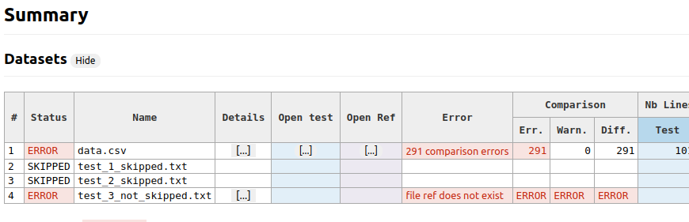

# Compare other options

## Instructions

1. `cd` to this folder
2. Run `scilens run .`

## Explainations

### `not_matching_source_ignore_pattern`

```yaml
compare:
  sources:
    not_matching_source_ignore_pattern: "^test_[0-9]+_skipped\\.txt$"
```



